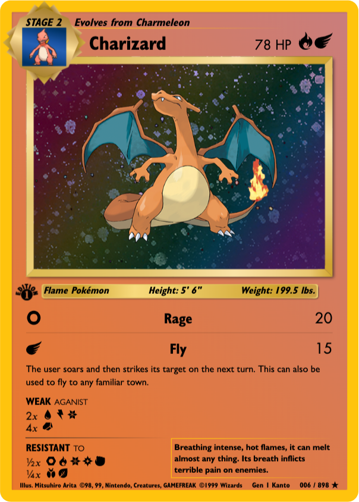
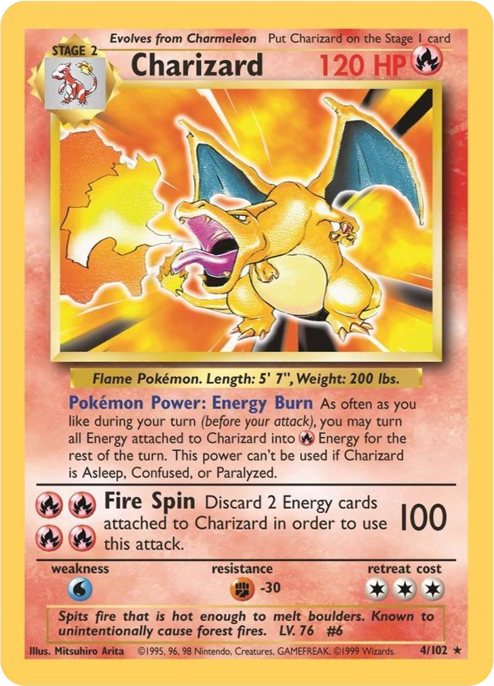

#  
[](https://pokevm.netlify.app)
[](https://app.netlify.com/sites/pokevm/deploys)

> PokéVM allows for endless exploration of all 898 currently discovered pokémon. Each pokémon is proportionality displayed as physical cards inspired by the original 1998 pokémon card base set.<br>
> PokéVM utilizes [PokéAPI](https://pokeapi.co/), a RESTful API service, that pulls data from every main series Pokémon game.

<br>

| PokéVM Demo | Charizard - PokéVM | Charizard - 1998 Release |
|     :---:   |        :---:       |          :---:           |
|  |  |  |


### Goals & Purpose
#### Implement a Design Pattern (Programming Architecture)
```text
Model-View-Controller(MVC).
The Reavealing Module Pattern.
    • Provides structure and encapsulation.
    • Immediately Invoked Function Expressions (IIFE)
Focused on clean, concise, & meaningful code.
```

#### Improve My Programming Capability
```text
Why Vanilla JS | HTML | CSS?
• To truly learn the language and to gain an appreciation for framework abstractions.

Primary Concepts Covered:
    • JavaScript's Event Loop & Hoisting
    • Closures & Scope
    • Promise handling with async..await operations
    • Loose module coupling
```

#### Responsive Design
```text
Limited media queries.
Utilized concepts of Fluid Typography:
    • Pokémon card is horizontally and vertically responsive.
    • Viewport-width coverage range: [375px, 1200px]
```

#### LIBARIES
[Vanilla Tilt](https://micku7zu.github.io/vanilla-tilt.js/)<br>
<a href="https://github.com/micku7zu/vanilla-tilt.js"></a>
<a href="https://github.com/micku7zu/vanilla-tilt.js/releases/"></a>

#### IMAGES & ICONS
[PokéBall Site Logo](https://www.pngegg.com/en/png-wnotu)<br>
SVG images designed using [Figma](https://www.figma.com/), exported and optimized using [SVGOMG](https://jakearchibald.github.io/svgomg/).
#### FONTS
[Futura LT Font Family](https://www.cufonfonts.com/font/futura-lt)<br>
[Gill Sans Font-Face](https://www.cufonfonts.com/font/gill-sans-std)<br>
[Humanst 521 Font-family](https://freefontsdownload.net/free-humanst521-bt-font-30991.htm)<br>
[Pokemon Font-Family](https://fontmeme.com/fonts/pokmon-font/)
#### UTILITY SITES
[Figma](https://www.figma.com/) - Prototyping tool & vector graphics editor<br>
[SVGOMG](https://jakearchibald.github.io/svgomg/) - SVG Optimization<br>
[Transfonter](https://transfonter.org/) - Generates @font-face stylesheets (.WOFF2)<br>
[this.markdown Logo](https://fontmeme.com/pokemon-font/) - PokéVM PNG image (readme specific)
