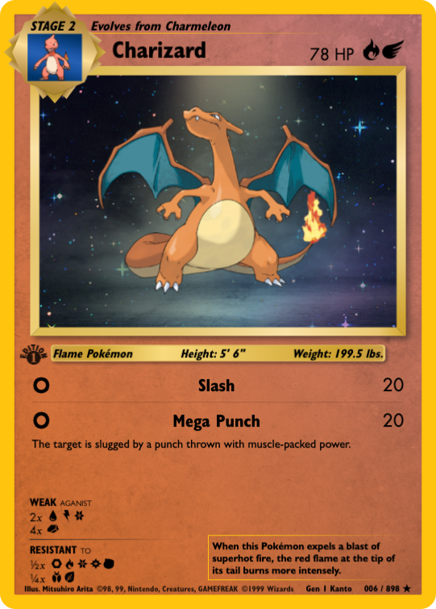
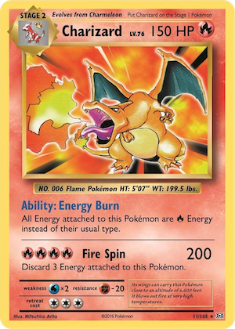

#  
[](https://pokevm.netlify.app)
[](https://app.netlify.com/sites/pokevm/deploys)

> PokéVM allows for endless exploration of all 898 currently discovered pokémon. Each pokémon is proportionality displayed as physical cards inspired by the original 1999 pokémon card base set and the 2016 updated reprint of the same design.<br>
> PokéVM utilizes [PokéAPI](https://pokeapi.co/), a RESTful API service, that pulls data from every main series Pokémon game.

<br>

<table>
    <tr style="font-size:16px">
        <th style="text-align:center">PokéVM Demo</th>
        <th style="text-align:center">PokéVM</th>
        <th style="text-align:center">2016 Reprint</th>
        <th style="text-align:center">1999 Release</th>
    </tr>
    <tr>
        <td style="width:25%"></td>
        <td style="width:25%"></td>
        <td style="width:25%"></td>
        <td style="width:25%"></td>
    </tr>
</table>


### Goals & Purpose
#### Implement a Design Pattern (Programming Architecture)
```text
Model-View-Controller(MVC).
The Reavealing Module Pattern.
    • Provides structure and encapsulation.
    • Immediately Invoked Function Expressions (IIFE)
Focused on clean, concise, & meaningful code.
```

#### Improve My Programming Capability
```text
Why Vanilla JS | HTML | CSS?
    • To truly learn the language and to gain an appreciation for framework abstractions.

Primary Concepts Covered:
    • JavaScript's Event Loop & Hoisting
    • Closures & Scope
    • Promise handling with async..await operations
    • Loose module coupling
```

#### Responsive Design
```text
Limited media queries.
Utilized concepts of Fluid Typography:
    • Pokémon card is horizontally and vertically responsive.
    • Viewport-width coverage range: [375px, 1200px]
```

#### LIBARIES
[Vanilla Tilt](https://micku7zu.github.io/vanilla-tilt.js/)<br>
<a href="https://github.com/micku7zu/vanilla-tilt.js"></a>
<a href="https://github.com/micku7zu/vanilla-tilt.js/releases/"></a>

#### IMAGES & ICONS
[PokéBall Site Logo](https://www.pngegg.com/en/png-wnotu)<br>
[Pokemon Display Blended Image](https://www.stockvault.net/photo/280971/dark-room-with-spotlight-and-concrete-floor-smoky-background)<br>
[Pokemon Display Blended Gif](https://s3-us-west-2.amazonaws.com/s.cdpn.io/13471/sparkles.gif)<br>
SVG images designed using [Figma](https://www.figma.com/), exported and optimized using [SVGOMG](https://jakearchibald.github.io/svgomg/).
#### FONTS
[Futura LT Font Family](https://www.cufonfonts.com/font/futura-lt)<br>
[Gill Sans Font-Face](https://www.cufonfonts.com/font/gill-sans-std)<br>
[Humanst 521 Font-family](https://freefontsdownload.net/free-humanst521-bt-font-30991.htm)<br>
[Pokemon Font-Family](https://fontmeme.com/fonts/pokmon-font/)
#### UTILITY SITES
[Figma](https://www.figma.com/) - Prototyping tool & vector graphics editor<br>
[SVGOMG](https://jakearchibald.github.io/svgomg/) - SVG Optimization<br>
[EZGIF](https://ezgif.com/) - GIF Editor<br>
[Transfonter](https://transfonter.org/) - Generates @font-face stylesheets (.WOFF2)<br>
[Favicon Generator](https://realfavicongenerator.net/)<br>
[this.markdown Logo](https://fontmeme.com/pokemon-font/) - PokéVM PNG image (readme specific)<br>
